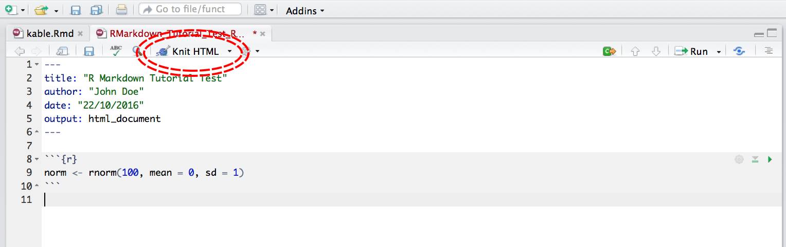
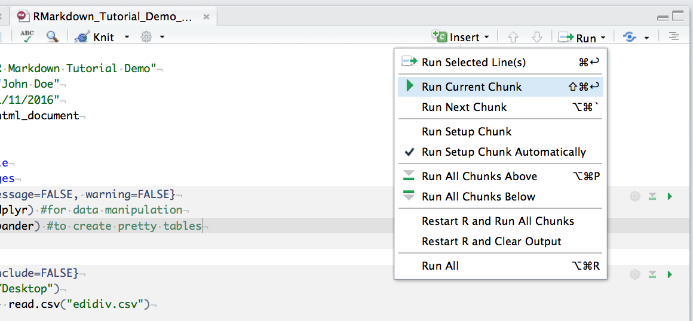
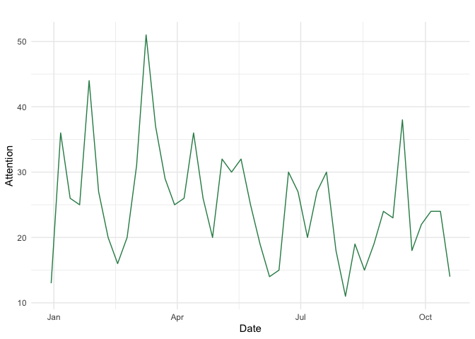
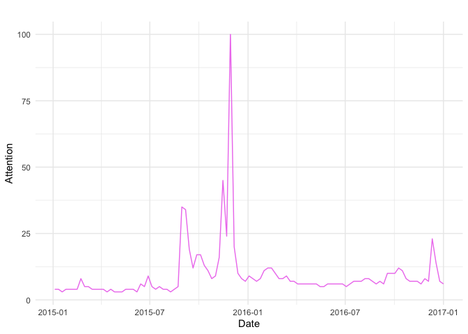

Tutorial: Intro to R Markdown & Data Retrieval
================
Mariken van der Velden & Kasper Welbers

# This Tutorial

The tutorials are designed as mini-hackathons. Hackathons are events
where people meet to engage in collaborative computer programming.
During the tutorials, students will work in pairs of two to replicate
the concept(s) central in (part of) the week’s literature. These
solutions result in methodological insights and data analytics for data
collection, linkage, analysis and presentation. Today, the tutorial
familiarizes you with working in `RMarkdown` as well as enables you to
get data from newspapers, using [AmCAT](http://vucw.amcat.nl/), get data
from online `.csv` files, and data from GoogleTrends. We will work with
these types of data troughout the course.

# Intro to RMarkdown

The mini-hackathons need to be completed using the
[RMarkdown](https://rmarkdown.rstudio.com/) templates provided on the
Canvas page of the course. Why do we use R Markdown? R Markdown allows
you to create documents that serve as a neat record of your analysis.
Because we care about open science, and therefore about reproducible
research, it is important that other researchers easily understand every
step: From gathering the raw data, to wrangling the data, to the final
analysis. Without opening up about the steps a researcher made to come
to the research conclusions, there is too much room for [*researcher
degrees of
freedom*](https://www.frontiersin.org/articles/10.3389/fpsyg.2016.01832/full).
Working with RMarkdown allows students to create a document as an
appendix to your thesis or project assignment that you are doing, upload
it to an online repository such as [Github](https://github.com/), or
simply to keep as a personal record so you can quickly look back at your
code and see what you did. RMarkdown presents your code alongside its
output (graphs, tables, etc.) with conventional text to explain it, a
bit like a notebook.

RMarkdown uses [Markdown
syntax](https://daringfireball.net/projects/markdown/syntax) (see
[here](https://rstudio.com/wp-content/uploads/2015/02/rmarkdown-cheatsheet.pdf)
for the cheatsheet, and [here](https://bookdown.org/yihui/rmarkdown/)
for an online guide). Markdown is a very simple ‘markup’ language which
provides methods for creating documents with headers, images, links etc.
from plain text files, while keeping the original plain text file easy
to read. You can convert Markdown documents to many other file types
like .html or .pdf to display the headers, images etc..

## 1\. Getting Started with RMarkdown

### Assignment: Working with RMarkdown - Install `rmarkdown` package

To get RMarkdown working in RStudio, the first thing you need is the
`rmarkdown` package, which you can get from
[CRAN](https://cran.r-project.org/web/packages/rmarkdown/index.html) by
running the following commands in R or RStudio:

``` r
install.packages("rmarkdown")
library(rmarkdown)
```

### Assignment: Create an RMarkdown file

To create a new RMarkdown file (.Rmd), select `File -> New File -> R
Markdown...` in `RStudio`, then choose the file type you want to create.
For now we will focus on a .html Document, which can be easily converted
to other file types later. The newly created .Rmd file comes with basic
instructions, but we want to create our own RMarkdown script, so go
ahead and delete everything in the example file.

Now open your Rscript of *Media monitoring opdracht 2* of the
*Nieuwsdynamiek in de Digitale Samenleving* and use the instructions
below to help you convert this script into a coherent RMarkdown
document, bit by bit. If you have any of your own R scripts that you
would like to make into an R Markdown document, you can also use those\!

### Assignment: Add a YAML Header

At the top of any RMarkdown script is a `YAML` header section enclosed
by `---`. By default this includes a title, author, date and the file
type you want to output to. Many other options are available for
different functions and formatting, see
[here](https://bookdown.org/yihui/rmarkdown/html-document.html) for
`.html` options and
[here](https://bookdown.org/yihui/rmarkdown/pdf-document.html) for
`.pdf` options. Rules in the header section will alter the whole
document. Have a flick through quickly to familiarise yourself with the
sorts of things you can alter by adding an option to the `YAML` header.

Insert something like this at the top of your new .Rmd script:

``` html
---
title: "Tutorial-1"
author: Mariken van der Velden
date: 28/Oct/2020
output: html_document
---
```

By default, the `title`, `author`, `date` and `output format` are
printed at the top of your `.html` document. This is the minimum you
should put in your header section. Now that we have our first piece of
content, we can test the `.Rmd` file by compiling it to `.html`. To
compile your `.Rmd` file into a `.html` document, you should press the
Knit button in the taskbar:



By default, RStudio opens a separate preview window to display the
output of your `.Rmd` file. If you want the output to be displayed in
the `Viewer` window in `RStudio` (the same window where you would see
plotted figures / packages / file paths), select “View in Pane” from the
drop down menu that appears when you click on the `Knit` button in the
taskbar, or in the `Settings gear icon` drop down menu next to the
`Knit` button. A preview appears, and a `.html` file is also saved to
the same folder where you saved your `.Rmd` file.

### Assignment: Add Code Chunks

Below the `YAML` header is the space where you will write your code,
accompanying explanation and any outputs. Code that is included in your
`.Rmd` document should be enclosed by three backwards apostrophes
` ``` ` (grave accents\!). These are known as code chunks and look like
this:

    ```{r}
    norm <- rnorm(100, mean = 0, sd = 1)
    ```

The `r` is inside curly brackets: `{r}`. This is a space where you can
assign rules for that code chunk. The code chunk above says that the
code is R code. We’ll get onto some other curly brace rules later.
**Have a go at grabbing some code from the example R script and
inserting it into a code chunk in your `.Rmd` document.** Remember: you
don’t have to hand in the assignment of this week’s tutorial, but from
next week onward, you are supposed to hand in assingments using
RMarkdown.

You can run an individual chunk of code at any time by placing your
cursor inside the code chunk and selecting `Run -> Run Current Chunk`:


#### To help you with your assignment: More on Code Chunks

It’s important to remember when you are creating an RMarkdown file that
if you want to run code that refers to an object, for example:

    ```{r}
    head(dataframe)
    ```

You have to include instructions showing what `dataframe` is, just like
in a normal R script. For example:

    ```{r}
    A <- c("a", "a", "b", "b")
    B <- c(5, 10, 15, 20)
    dataframe <- data.frame(A, B)
    plot(dataframe)
    ```

Or if you are loading a dataframe from a `.csv` file, you must include
the code in the `.Rmd`:

    ```{r}
    dataframe <- read.csv("~/Desktop/Code/dataframe.csv")
    #Remember to work from projects!
    ```

Similarly, if you are using any packages in your analysis, you will have
to load them in the `.Rmd` file using `library()` as in a normal `R`
script.

    ```{r}
    library(dplyr)
    ```

#### Hiding code chunks

If you don’t want the code of a particular code chunk to appear in the
final document, but still want to show the output (e.g. a plot), then
you can include `echo = FALSE` in the code chunk instructions: `{r, echo
= FALSE}`.

    ```{r, echo = FALSE}``

Similarly, you might want to create an object, but not include both the
code and the output in the final `.html` file. To do this you can use,
`include = FALSE`: `{r, include = FALSE}`.

    ```{r, include = FALSE}
    A <- c("a", "a", "b", "b")
    B <- c(5, 10, 15, 20)
    dataframe <- data.frame(A, B)
    plot(dataframe)
    ```

Be aware though, when making reproducible research it’s often not a good
idea to completely hide some part of your analysis\! In some cases, when
you load packages into `RStudio`, various warning messages such as
*“Warning: package ‘dplyr’ was built under R version 3.4.4”* might
appear. If you do not want these warning messages to appear, you can use
`warning = FALSE`: `{r, warning = FALSE}`.

    ```{r, warning = FALSE}
    library(dplyr)
    ```

**REMEMBER**: R Markdown does not pay attention to anything you have
loaded in other R scripts, you MUST load all objects and packages in the
R Markdown script.

#### More Code Chunk Instructions

<table>

<tr>

<th>

Rule

</th>

<th>

Example

</th>

<th>

Function

</th>

</tr>

<tr>

<td>

eval

</td>

<td>

eval=TRUE

</td>

<td>

Is the code run and the results included in the output?

</td>

</tr>

<tr>

<td>

include

</td>

<td>

include=TRUE

</td>

<td>

Are the code and the results included in the output?

</td>

</tr>

<tr>

<td>

echo

</td>

<td>

echo=TRUE

</td>

<td>

Is the code displayed alongside the results?

</td>

</tr>

<tr>

<td>

warning

</td>

<td>

warning=TRUE

</td>

<td>

Are warning messages displayed?

</td>

</tr>

<tr>

<td>

error

</td>

<td>

error=FALSE

</td>

<td>

Are error messages displayed?

</td>

</tr>

<tr>

<td>

message

</td>

<td>

message=TRUE

</td>

<td>

Are messages displayed?

</td>

</tr>

<tr>

<td>

tidy

</td>

<td>

tidy=FALSE

</td>

<td>

Is the code reformatted to make it look “tidy”?

</td>

</tr>

<tr>

<td>

results

</td>

<td>

results=“markup”

</td>

<td>

<b> How are results treated? </b> <br> “hide” = no results <br>“asis” =
results without formatting <br>“hold” = results only compiled at end of
chunk (use if many commands act on one object)

</td>

</tr>

<tr>

<td>

cache

</td>

<td>

cache=FALSE

</td>

<td>

Are the results cached for future renders?

</td>

</tr>

<tr>

<td>

comment

</td>

<td>

comment=“\#\#”

</td>

<td>

What character are comments prefaced with?

</td>

</tr>

<tr>

<td>

fig.width, <br>fig.height

</td>

<td>

fig.width=7

</td>

<td>

What width/height (in inches) are the plots?

</td>

</tr>

<tr>

<td>

fig.align

</td>

<td>

fig.align=“left”

</td>

<td>

“left” “right” “center”

</td>

</tr>

</table>

#### Inserting Figures

Inserting a graph into RMarkdown is easy, the more energy-demanding
aspect might be adjusting the formatting.

By default, RMarkdown will place graphs by maximising their height,
while keeping them within the margins of the page and maintaining aspect
ratio. If you have a particularly tall figure, this can mean a really
huge graph. In the following example we modify the dimensions of the
figure we created above. To manually set the figure dimensions, you can
insert an instruction into the curly braces: `{r, fig.width = 4,
fig.height = 3, }`.

    ```{r, fig.width = 4, fig.height = 3, }
    A <- c("a", "a", "b", "b")
    B <- c(5, 10, 15, 20)
    dataframe <- data.frame(A, B)
    plot(dataframe)
    ```

#### Inserting Tables

#### Standard R Markdown

While R Markdown can print the contents of a data frame easily by
enclosing the name of the data frame in a code chunk:

    ```{r}
    dataframe
    ```

This can look a bit messy, especially with data frames with a lot of
columns. Including a formal table requires more effort.

#### kable() function from knitr package

The most aesthetically pleasing and simple table formatting function I
have found is `kable()` in the `knitr` package. The first argument tells
kable to make a table out of the object `dataframe` and that numbers
should have two significant figures. Remember to load the `knitr`
package in your `.Rmd` file as well.

    ```{r}
    # Don't forget to run: install.packages("knitr") before!
    library(knitr)
    kable(dataframe, digits = 2)
    ```

#### Creating tables from model outputs

Using `tidy()` from the package `broom`, we are able to create tables of
our model outputs, and insert these tables into our markdown file. The
example below shows a simple example linear model, where the summary
output table can be saved as a new R object and then added into the
markdown file.

    ```{r}
    library(broom)
    library(pander)
    A <- c(20, 15, 10)
    B <- c(1, 2, 3)
    
    lm_test <- lm(A ~ B)            # Creating linear model 
    summary(lm_test)                # Obtaining linear model summary statistics
    
    table_obj <- tidy(lm_test)      # Using tidy() to create a new R object called table 
    pander(table_obj, digits = 3)   # Using pander() to view the created table, with 3 sig figs 
    ```

#### Formatting Text

Markdown syntax can be used to change how text appears in your output
file. Here are a few common formatting commands:

`*Italic*`

*Italic*

<hr>

`**Bold**`

**Bold**

<hr>

This is \`code\` in text

This is `code` in text

<hr>

`# Header 1`

# Header 1

<hr>

`## Header 2`

## Header 2

Note that when a `#` symbol is placed inside a code chunk it acts as a
normal R comment, but when placed in text it controls the header size.

<hr>

`* Unordered list item`

<li>

Unordered list item

</li>

<hr>

`1. Ordered list item`

1.  Ordered list item

<hr>

`[Link](https://www.google.com)`

[Link](https://www.google.com)

<hr>

`$A = \pi \times r^{2}$`


The `$` symbols tells R markdown to use [LaTeX equation
syntax](http://reu.dimacs.rutgers.edu/Symbols.pdf).

#### Creating `.pdf` files in Rmarkdown

Creating `.pdf` documents for printing in A4 requires a bit more
fiddling around. RStudio uses another document compiling system called
[LaTeX](https://www.latex-project.org/) to make `.pdf` documents.

To compile a `.pdf` instead of a `.html` document, change `output:` from
`html_document` to `pdf_document`.

<br>

## 2\. Data Retrieval

Now you have gotten the gist of working with RMarkdown, the second half
of this tutorial is aimed at getting data from:

1.  [AmCAT](http://vucw.amcat.nl/);
2.  online `.csv` files, for example from the [FiveThirtyEight
    website](https://github.com/fivethirtyeight)
3.  [GoogleTrends](https://trends.google.com/trends/).

### Working with AmCAT

Since we’re going to need a lot of data, we’ll use the large AmCAT
server that contains some substantial data collections, at
<http://vucw.amcat.nl>. For this course, your password and login name
are your hackathon team number: e.g. username: group1, password: group1.

If you log in and go to Projects (recently visited projects, or the
projects page) you’ll find project 21: US election 2020. In here, you’ll
find an articleset for this course: Guardian and Observer newspapers
from 2020 about Biden and Trump. In this course, we will not query
within AmCAT, but using R.

#### Query AmCAT

This week, we will practice with querying in AmCAT, next week, we will
retrieve data for actual analysis.

First, we need to load the package needed:

``` r
#devtools::install_github("amcat/amcat-r")
library(amcatr)
```

Second, in order to login, we need to tell R your
credentials:

``` r
amcat.save.password("http://vucw.amcat.nl", username="GROUP + NUMBER", password="GROUP + NUMBER")
```

Imagine you would be interested in how often Trump and/or Biden mention
the EU, you could use the following query to see the frequency of the EU
being mentioned:

``` r
conn <- amcat.connect('http://vucw.amcat.nl')

## query amcat and download results, aggregated by week
news <- amcat.aggregate(conn, queries = 'eu', labels = 'EU', sets = 21, axis1='week')
head(news)
```

| count | week       | query |
| ----: | :--------- | :---- |
|    13 | 2019-12-30 | EU    |
|    36 | 2020-01-06 | EU    |
|    26 | 2020-01-13 | EU    |
|    25 | 2020-01-20 | EU    |
|    44 | 2020-01-27 | EU    |
|    27 | 2020-02-03 | EU    |

You could also plot this over time:

``` r
library(tidyverse)
ggplot(data = news, mapping = aes(x = week, y = count)) +
  geom_line(color="seagreen") +
  labs(x = "Date", y = "Attention", title = "") +
  theme_minimal()
```

<!-- -->

#### Assignment: Working with AmCAT queries

Choose a concept and search it on AmCAT. Make it so that the hits are
aggregated by week, and arranged in a wide format. Try out to visualize
your data. This week is just to familiarize you with working with AmCAT
from R. Next week, we will start with the hackathons and collect data.

### Google trends data

With [google trends](https://trends.google.com/trends/) you can explore
how often people searched for a keyword, in web search or in google
news. Since people presumably search for information on topics they find
important or interesting, this can be used as a crude proxy for public
salience of a topic. For example, if you search for `gun control` you
find a clear peak after the recent Las Vegas shooting and around earlier
mass shootings, and a smaller peak around the US elections.

#### Accessing google trends from R

Google offers the data through an API, so (naturally) there is an R
package to retrieve the data. Before starting, you need to install the
package from
github:

``` r
if (!require(devtools)) {install.packages("devtools"); library(devtools)}
devtools::install_github("PMassicotte/gtrendsR")
```

Now, you can use the `gtrends` function to query for a specific keyword.
For example, this shows the attention for ‘Syria’ in the UK in
2015-2016, you can use a query like:

``` r
library(gtrendsR)
res <- gtrends(c("syria"), geo = c("GB"), time="2015-01-01 2017-01-01")

trend <- res$interest_over_time
tail(trend)
```

|     | date       | hits | keyword | geo | time                  | gprop | category |
| :-- | :--------- | ---: | :------ | :-- | :-------------------- | :---- | -------: |
| 100 | 2016-11-27 |    8 | syria   | GB  | 2015-01-01 2017-01-01 | web   |        0 |
| 101 | 2016-12-04 |    7 | syria   | GB  | 2015-01-01 2017-01-01 | web   |        0 |
| 102 | 2016-12-11 |   23 | syria   | GB  | 2015-01-01 2017-01-01 | web   |        0 |
| 103 | 2016-12-18 |   14 | syria   | GB  | 2015-01-01 2017-01-01 | web   |        0 |
| 104 | 2016-12-25 |    7 | syria   | GB  | 2015-01-01 2017-01-01 | web   |        0 |
| 105 | 2017-01-01 |    6 | syria   | GB  | 2015-01-01 2017-01-01 | web   |        0 |

And you can e.g. plot this over time:

``` r
ggplot(data = trend, mapping = aes(x = date, y = hits)) +
  geom_line(color="violet") +
  labs(x = "Date", y = "Attention", title = "") +
  theme_minimal()
```

<!-- -->

Note: If you want to merge this with AmCAT aggregate data, one problem
is that google trends weeks start on Sunday, while AmCAT weeks start on
Monday. The easiest solution is to add one day to the google trends
data, which is mostly fine since newspapers generally don’t appear on
Sunday.

When working with time data, it’s important to take into account that
date/time can be represented in different formats. In our case, we need
to first convert the Google trends date into a *Date format*. For
illustration, we make a separate date value, called `date2`, so you can
see whether there are no problems in the conversion

``` r
trend <- trend %>%
  mutate(date2 = as.Date(as.character(trend$date)))
tail(trend)
```

|     | date       | hits | keyword | geo | time                  | gprop | category | date2      |
| :-- | :--------- | ---: | :------ | :-- | :-------------------- | :---- | -------: | :--------- |
| 100 | 2016-11-27 |    8 | syria   | GB  | 2015-01-01 2017-01-01 | web   |        0 | 2016-11-27 |
| 101 | 2016-12-04 |    7 | syria   | GB  | 2015-01-01 2017-01-01 | web   |        0 | 2016-12-04 |
| 102 | 2016-12-11 |   23 | syria   | GB  | 2015-01-01 2017-01-01 | web   |        0 | 2016-12-11 |
| 103 | 2016-12-18 |   14 | syria   | GB  | 2015-01-01 2017-01-01 | web   |        0 | 2016-12-18 |
| 104 | 2016-12-25 |    7 | syria   | GB  | 2015-01-01 2017-01-01 | web   |        0 | 2016-12-25 |
| 105 | 2017-01-01 |    6 | syria   | GB  | 2015-01-01 2017-01-01 | web   |        0 | 2017-01-01 |

One (particularly mean) thing to watch out for, is that there can be
problems due to different time zones. If Google trends returns a date
and time at `2016-01-01 00:00:00` in a certain timezone, then depending
on your time locale settings (don’t ask) R might think that it needs to
subtract some hours, after which your date suddenly becomes
`2015-12-31`\! Thus, for your output, you should check whether the
converted date (`date2`) is still on the same day as the original date
(`date`). If not, you should add `1` to the date (which R interprets as:
add one day). In the following example, we add a third date column to
illustrate this:

``` r
trend <- trend %>%
  mutate(date3 = as.Date(as.character(trend$date)) + 1)
tail(trend)
```

|     | date       | hits | keyword | geo | time                  | gprop | category | date2      | date3      |
| :-- | :--------- | ---: | :------ | :-- | :-------------------- | :---- | -------: | :--------- | :--------- |
| 100 | 2016-11-27 |    8 | syria   | GB  | 2015-01-01 2017-01-01 | web   |        0 | 2016-11-27 | 2016-11-28 |
| 101 | 2016-12-04 |    7 | syria   | GB  | 2015-01-01 2017-01-01 | web   |        0 | 2016-12-04 | 2016-12-05 |
| 102 | 2016-12-11 |   23 | syria   | GB  | 2015-01-01 2017-01-01 | web   |        0 | 2016-12-11 | 2016-12-12 |
| 103 | 2016-12-18 |   14 | syria   | GB  | 2015-01-01 2017-01-01 | web   |        0 | 2016-12-18 | 2016-12-19 |
| 104 | 2016-12-25 |    7 | syria   | GB  | 2015-01-01 2017-01-01 | web   |        0 | 2016-12-25 | 2016-12-26 |
| 105 | 2017-01-01 |    6 | syria   | GB  | 2015-01-01 2017-01-01 | web   |        0 | 2017-01-01 | 2017-01-02 |

Now that you have a date in the same format as used by `amcatr`, we can
merge with amcat aggregate data without problem.

Note: there are more elegant ways of dealing with date and time
problems, but we ignore those for now for sake of simplicity.

#### Options and limitations

To see the options provided by Google Trends and `gtrendsr`, look at the
google trends homepage and at the gtrends help file (in RStudio). In
particular, you can specify which country, which date range, and which
source (web, news, video) to search in. Unfortunately, you can’t specify
the date interval - google automatically decides to return monthly,
weekly, or daily data depending on how long your query is. You can also
not complex queries like in AmCAT, you can only use simple keywords or
phrases. Also, the results returned by google are always relative (the
highest peak is always 100), so you can’t simply compare data retrieved
in multiple queries: you either need to put everything in a single
query, or have an overlap in data and use that to callibrate the
different sets.

#### Assignment: Working with Google trends data

Choose a concept and search it on Google trends. Make it so that the
hits are aggregated by week, and arranged in a wide format. Try to
visualize your data. This week is just to familiarize you with working
with Goolge trends from R. Next week, we will start with the hackathons
and collect data.

### Open `.csv` from online source

CSV stands for comma-separated values. It’s a simple and widely used
format for storing tabular (i.e. data in rows and columns) data. The
nice thing about CSV is that it’s essentially a plain text file. The
different rows of the tabular data are indicated by different lines in
the text file. The different columns are indicated by the use of a
“delimiter character” (often a comma or semicolon) that splits the
lines into column.

The advantage of this format is that it can be imported by virtually any
software that uses tabular data (e.g., Excel, SPSS, R, Stata). Because
it’s so simple, it holds few surprises. In comparison, if tabular data
is stored as an Excel file, there might be Excel specific data that goes
beyond a simple data table (e.g., formulas, muliple sheets).

That being said, there is sadly no universal standard for what a CSV
file looks like. The name “commma-separated values” refers to a comma
being used as a delimiter, but this can also be a semicolon, or a tab.
Also, CSV files require a “quotation character” (often a double quote)
in case the data contains texts. For example, if the delimiter character
is a comma, and a column contains the name “Trump, Donald”, it needs to
be clear that this comma is part of the text and not to be interpreted
as a delimiter. Another important settings is whether a dot or a comma
is used as the decimal point.

Luckily, the diversity of such settings in CSV files is limited today.
The `readr` package (which is part of the tidyverse) therefore has 3
general flavours and 1 more versatile function.

  - `read_csv` is the default with a comma separator and dot for decimal
    point. This is often what you need.
  - `read_csv2` uses a semicolon (;) separator with comma for decimal
    point.
  - `read_tsv` uses tabs as separator (tsv stands for tab-separated
    values). (`read_csv`, `read_csv2`, `read_tsv`). If you encounter a
    CSV
  - `read_delim` lets you specify the delimiter and quotation character,
    and some other settings.

Naturally, this is all properly documented:

``` r
?read_csv
```

You can read CSV files with the function from your local device by
giving the location on your computer as the first argument. If you have
trouble finding the right way to specify the location, you can also use
the files browser in the bottom-right corner in Rstudio. If you click on
a .csv file, you can get an import window that also uses `readr`.

Conveniently, you can also read CSV files directly from the internet.
For example, the data used by fivethirtyeight.com is published as csv
files. Simply speaking, if you have a URL that point directly to a .csv
file, you can directly download and read it into
R.

``` r
url <- 'https://projects.fivethirtyeight.com/2020-general-data/presidential_state_toplines_2020.csv'
d <- read_csv(url)
```

Note that `read_csv` immediately tells you how it parsed the data (and
warns you if it notices that things went
badly).

``` r
head(d)
```

| cycle | branch    | model      | modeldate  | candidate\_inc | candidate\_chal | candidate\_3rd | state         |   tipping |       vpi | winstate\_inc | winstate\_chal | winstate\_3rd | voteshare\_inc | voteshare\_chal | voteshare\_3rd | voteshare\_other | voteshare\_inc\_hi | voteshare\_chal\_hi | voteshare\_3rd\_hi | voteshare\_other\_hi | voteshare\_inc\_lo | voteshare\_chal\_lo | voteshare\_3rd\_lo | voteshare\_other\_lo |      margin |  margin\_hi | margin\_lo | win\_EC\_if\_win\_state\_inc | win\_EC\_if\_win\_state\_chal | win\_state\_if\_win\_EC\_inc | win\_state\_if\_win\_EC\_chal | state\_turnout | state\_turnout\_hi | state\_turnout\_lo | timestamp            | simulations |
| ----: | :-------- | :--------- | :--------- | :------------- | :-------------- | :------------- | :------------ | --------: | --------: | ------------: | -------------: | :------------ | -------------: | --------------: | :------------- | ---------------: | -----------------: | ------------------: | :----------------- | -------------------: | -----------------: | ------------------: | :----------------- | -------------------: | ----------: | ----------: | ---------: | ---------------------------: | ----------------------------: | ---------------------------: | ----------------------------: | -------------: | -----------------: | -----------------: | :------------------- | ----------: |
|  2020 | President | polls-plus | 10/28/2020 | Trump          | Biden           | NA             | Wyoming       | 0.0000125 | 0.0073945 |      0.998775 |       0.001225 | NA            |       67.57626 |        29.38370 | NA             |        3.0400510 |           72.98618 |            34.74894 | NA                 |             4.628999 |           62.12553 |            24.06807 | NA                 |            1.6539610 |   38.192560 |   48.782420 |   27.50507 |                    0.1154915 |                     0.9795918 |                    0.9997833 |                     0.0013635 |       272928.7 |           317754.0 |           229676.0 | 10:29:04 28 Oct 2020 |       40000 |
|  2020 | President | polls-plus | 10/28/2020 | Trump          | Biden           | NA             | Wisconsin     | 0.0607000 | 2.8427970 |      0.061550 |       0.938450 | NA            |       45.37839 |        53.70832 | NA             |        0.9132881 |           48.80832 |            57.08505 | NA                 |             1.356502 |           41.99062 |            50.28198 | NA                 |            0.5174813 |  \-8.329926 |  \-1.474642 | \-15.08174 |                    0.8294070 |                     0.9275667 |                    0.4424702 |                     0.9890637 |      3310824.0 |          3737713.0 |          2895063.0 | 10:29:04 28 Oct 2020 |       40000 |
|  2020 | President | polls-plus | 10/28/2020 | Trump          | Biden           | NA             | West Virginia | 0.0000500 | 0.0114606 |      0.988400 |       0.011600 | NA            |       63.10468 |        35.08353 | NA             |        1.8117870 |           69.49330 |            41.50108 | NA                 |             2.728519 |           56.66076 |            28.70397 | NA                 |            1.0043070 |   28.021150 |   40.771360 |   15.22908 |                    0.1165267 |                     0.9827586 |                    0.9982665 |                     0.0129531 |       749385.3 |           866117.5 |           636684.0 | 10:29:04 28 Oct 2020 |       40000 |
|  2020 | President | polls-plus | 10/28/2020 | Trump          | Biden           | NA             | Washington    | 0.0028875 | 0.1158887 |      0.009900 |       0.990100 | NA            |       37.37862 |        60.50002 | NA             |        2.1213600 |           42.65926 |            65.77175 | NA                 |             3.205749 |           32.10382 |            55.20705 | NA                 |            1.1694810 | \-23.121400 | \-12.589750 | \-33.62102 |                    0.3308081 |                     0.8822341 |                    0.0283857 |                     0.9925008 |      3865393.0 |          4383465.0 |          3361572.0 | 10:29:04 28 Oct 2020 |       40000 |
|  2020 | President | polls-plus | 10/28/2020 | Trump          | Biden           | NA             | Virginia      | 0.0115875 | 0.3937938 |      0.009825 |       0.990175 | NA            |       43.32146 |        55.71736 | NA             |        0.9611730 |           46.54315 |            58.92624 | NA                 |             1.429014 |           40.10530 |            52.47780 | NA                 |            0.5437651 | \-12.395900 |  \-5.973042 | \-18.80868 |                    0.8498728 |                     0.8873684 |                    0.0723727 |                     0.9983525 |      4585481.0 |          5177173.0 |          4003434.0 | 10:29:04 28 Oct 2020 |       40000 |
|  2020 | President | polls-plus | 10/28/2020 | Trump          | Biden           | NA             | Vermont       | 0.0001875 | 0.0810101 |      0.006425 |       0.993575 | NA            |       30.84590 |        66.62216 | NA             |        2.5319420 |           38.00168 |            73.68081 | NA                 |             3.840321 |           23.82847 |            59.39259 | NA                 |            1.3870230 | \-35.776260 | \-21.476680 | \-49.76702 |                    0.2723735 |                     0.8811111 |                    0.0151679 |                     0.9947165 |       345585.3 |           395049.0 |           297370.5 | 10:29:04 28 Oct 2020 |       40000 |

``` r
#or tail(d) for the last 6 observations
```

#### A word of caution

Be very carefull with opening CSV files in Excel. Excel if will often
try to guess how the CSV files should be parsed, and this can often go
(partially) wrong. Even if you only open it and then save it, it might
still have messed up your data.

If you want to import CSV files into Excel to work with them in Excel,
make sure to properly import the file. If you only want to have a look
before loading the data into R, DO NOT OVERWRITE the original CSV.

#### Assignment: Working with online `.csv` files

Have a look at the [fivethirtyeight
website](https://github.com/fivethirtyeight), choose a data set and try
to open it in R. Visualize a variable in that data set.
