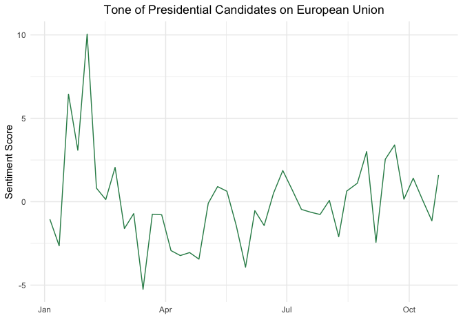
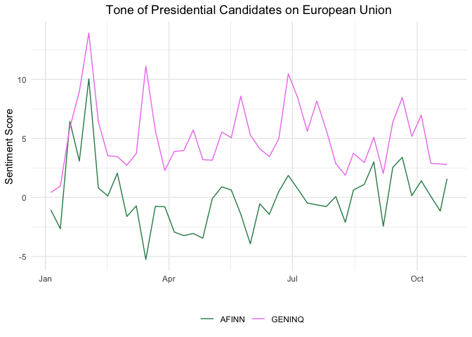

Mini-Hackathon 1: Sentiment Analysis
================
Mariken van der Velden & Kasper Welbers

Mini-Hackathons are performed and submitted in pairs of two. You must
hand in your assignment on Canvas the next week before **Tuesday
Midnight**.

Use this RMarkdown template on the canvas page for this mini-hackathon
to complete your hackathon. When you are finished, knit the file into a
pdf with the knit button in the toolbar (or using Ctrl+Shift+K). For
this you need to have the `knitr` and `printr` packages installed, and
all your code needs to work (see the R course companion for more
instructions). If you cannot knit the `.Rmd` file, there is probably an
error in your R code, therefore add `eval=FALSE` to the code chunk: `{r,
eval = FALSE}`, so you are still able to knit and upload the file.

# This Mini-Hackathon

This mini-hackathon builds upon the tutorial on [sentiment
analysis](https://github.com/ccs-amsterdam/r-course-material/blob/master/tutorials/sentiment_analysis.md).
For this hackathon, you can (and are strongly recommended to) use code
from this week’s tutorial as well as provided here. If you aim to
conduct additional analyses in R, we of course encourage this.
Nevertheless, it is important to not do additional analysis just for the
sake of running more code chunks. For that reason, please provide a
justification for these additional analyses.

Also, we recommend to use parameters for RMarkdown codeblocks, in
particular the `cache = TRUE` parameter for codeblocks that take long to
compute (e.g., downloading data from AmCAT). A brief explanation of some
usefull parameters is given in the [the tutorial of last
week](https://github.com/MarikenvdVelden/Replication-Hackathons/blob/main/Intro-to-rmd-and-data-retrieval.md).

Important to take into account is that this week you laptop will be
doing the heavy lifting. Accordingly, in the assignment, you should be
carefull not to choose a concept that has too many articles.

### Hackathon Challenges

#### Challenge 1

Choose a political issue and perform a sentiment analysis. To do so, we
will work with the AmCAT data set on the US presidential candidates in
2020. To get the data, one can run the following code to download the
data from AmCAT for the political issue you aim to study. For example,
if one wants to know what the presidential candidates say about the
European Union, you can run the code chunk below. If you are interested
in another political issue, you can adapt the query. If you did not yet
install the `amcatr` package yet, take a look at [the tutorial of last
week](https://github.com/MarikenvdVelden/Replication-Hackathons/blob/main/Intro-to-rmd-and-data-retrieval.md)
to see how to do this.

``` r
library(amcatr) #have you installed this library last time?

conn <- amcat.connect('http://vucw.amcat.nl')
d <- amcat.hits(conn, queries = '"european union"', labels = 'eu', sets = 21, 
                project = 1, col = c('date','medium','headline','text')) 
#Check project number and article set number by logging in on http://vucw.amcat.nl/
#do note the " within the ' to connect the two words and  NOT search for health AND care
```

Do remind that in order to login, we need to tell R your credentials. So
if you didn’t do it last week, or work on a different computer, don’t
forget to
run:

``` r
amcat.save.password("http://vucw.amcat.nl", username="team + number (e.g. team01)", password="team + number (e.g. team01)")
```

To conduct the sentiment analysis using a dictionary, we have to create
a document-term matrix (DTM), for more information about DTM, [see the
tutorial on basic text analysis with
quanteda](https://github.com/ccs-amsterdam/r-course-material/blob/master/tutorials/R_text_3_quanteda.md).

``` r
library(quanteda) #Have you installed the package? If not, use install.packages("quanteda")

#First: create a corpus
corp <- corpus(d, docid_field = 'id', text_field = 'text')

#Next: we can create a dtm
dtm <- corp %>% 
        dfm(remove = stopwords("english"), remove_punct = T) %>% 
        dfm_trim(min_docfreq = 5)
dtm
```

    ## Document-feature matrix of: 1,419 documents, 26,942 features (96.4% sparse) and 5 docvars.
    ##      features
    ## docs  6.01pm gmt going bring blog close now us politics live
    ##   26       1  63     3     5    2     4   9 61        2    2
    ##   135      0   0     0     0    0     0   4 14        0    0
    ##   145      0  33     1     0    0     0   4 18        0    0
    ##   158      0  45     6     0    2     7   9  5        5    1
    ##   305      0  56    13     3    1     3   9 13        3    4
    ##   310      0   0     0     0    0     1   0  7        1    0
    ## [ reached max_ndoc ... 1,413 more documents, reached max_nfeat ... 26,932 more features ]

We will work with the dictionaries implemented in an additional package
of quanteda. To be able to use this extension, make sure to install the
development version, because it inlcudes features that are not yet on
the released CRAN version. Please run:

``` r
devtools::install_github("kbenoit/quanteda.dictionaries") 
```

Thereafter, load the dictionary and inspect which dictionaries are
included in this package:

``` r
library(quanteda.dictionaries)
?`quanteda.dictionaries-package`
```

Choose a dictionary from `quanteda.dictionaries` and run this over the
news articles collected from AmCAT.

``` r
AFINN_dict <- dictionary(data_dictionary_AFINN)

result_AFINN <- dtm %>% 
  dfm_lookup(AFINN_dict) %>% 
  convert(to = "data.frame") %>% 
  as_tibble

head(result_AFINN)
```

| document | negative | positive |
| :------- | -------: | -------: |
| 26       |      297 |      120 |
| 135      |       13 |       10 |
| 145      |       96 |      110 |
| 158      |      134 |      180 |
| 305      |      168 |      258 |
| 310      |       44 |       20 |

Subsequently normalize the length of documents and compute a sort of
overall sentiment score as explained in the [sentiment
tutorial](https://github.com/ccs-amsterdam/r-course-material/blob/master/tutorials/sentiment_analysis.md).

``` r
result_AFINN <- result_AFINN %>% 
  mutate(length = ntoken(dtm),
         sentiment1 = (positive - negative) / (positive + negative),
         sentiment2 = (positive - negative) / length,
         subjectivity = (positive + negative) / length)
```

Visualize the results of the sentiment analysis using the code below.
**NOTE**: the code chunck below assumes that you have created a
sentiment variable yourself, in the example I have called the variable
`sentiment1`. If you rename your sentiment variable differently, change
the code accordingly. My sentiment variable uses the following code from
the [sentiment
tutorial](https://github.com/ccs-amsterdam/r-course-material/blob/master/tutorials/sentiment_analysis.md):
`mutate(sentiment1=(positive - negative) / (positive + negative))`. You
can use a different way to calculate the sentiment, but be aware that
depending on the method that you use to calculate sentiment, the result
might differ from the results you see here in this file.

You can go wild with
[colors](http://www.stat.columbia.edu/~tzheng/files/Rcolor.pdf), if you
like. Use an aggregation level (days, weeks, months) that makes sense to
you, and interpret the results. You are recommended to use multiple
codeblocks, and to use `cache = T` where usefull.

``` r
# Add date variable to results
result_AFINN <- result_AFINN %>%
  mutate(date = as.Date(docvars(corp, "date")),
         id = "AFINN")

#Aggregate to the month level
library(tidyquant)
df <- result_AFINN %>%
    tq_transmute(select     = sentiment1,
                 mutate_fun = apply.weekly, #or apply.monthly for week level
                 FUN        = sum)
head(df)
```

| date       |  sentiment1 |
| :--------- | ----------: |
| 2020-01-05 | \-1.0524540 |
| 2020-01-12 | \-2.6452389 |
| 2020-01-19 |   6.4477295 |
| 2020-01-26 |   3.0865824 |
| 2020-02-02 |  10.0503521 |
| 2020-02-09 |   0.8135491 |

``` r
library(tidyverse)
ggplot(df, mapping = aes(x = date, y = sentiment1)) +
  geom_line(color = "seagreen") +
  labs(x = "", y = "Sentiment Score", 
       title= "Tone of Presidential Candidates on European Union") +
  theme_minimal() +
  theme(plot.title = element_text(hjust = 0.5)) #to center the title of the plot
```

<!-- -->

#### Challenge 2

If you use another dictionary, would you get the same results? [Recent
work by Wouter van Atteveldt, Mariken van der Velden, and Mark Boukes
shows that the results of sentiment analysis vastly differ between
dictionaries.](https://github.com/vanatteveldt/ecosent) Conduct a second
sentiment analysis using another dictionary from
`quanteda.dictionaries`. Check and interpret the correlation between the
sentiment analysis of the two different dictionaries. I have added the
`data_dictionary_geninqposneg` dictionary.

``` r
cor(result_AFINN$sentiment1, result_GENINQ$sentiment1)
```

    ## [1] 0.5123131

To understand the outcome of the correlation better, it can be useful to
visualize the over time trends of sentiment on the European Union
reported in the news on the presidential candidates for both
dictionaries.

``` r
df <- result_AFINN %>%
  add_row(result_GENINQ) %>%
  group_by(id) %>%
    tq_transmute(select     = c(sentiment1),
                 mutate_fun = apply.weekly, #or apply.monthly for week level
                 FUN        = sum)
#head(df)

ggplot(df, mapping = aes(x = date, y = sentiment1, group = id, colour = id)) +
  geom_line() +
  labs(x = "", y = "Sentiment Score", 
       title= "Tone of Presidential Candidates on European Union") +
  theme_minimal() +
  scale_color_manual(values=c("seagreen", "violet")) +
  theme(plot.title = element_text(hjust = 0.5),
        legend.title=element_blank(), #edit the legend
        legend.position = "bottom") #to center the title of the plot
```

<!-- -->

#### Challenge 3

Reflect on the validity of the current analysis, both at the level of
specific hits and at an aggregate level. For the validity of specific
hits, look at the `Key-Word-In-Context` listings for the 20 first hits,
as discussed in the [sentiment
tutorial](https://github.com/ccs-amsterdam/r-course-material/blob/master/tutorials/sentiment_analysis.md).
Do the sentiment words correctly relate to the sentiment with which your
concept is discussed (note: only focus on the words between angle
brackets)? If the specific hits do not accurately measure sentiment, do
you think the aggregate results are still usefull in your case?

#### Challenge 4

The method used in the tutorial is pretty crude. Even for dictionary
methods, there are ways to improve results. Can you think of any problem
in particular, and any ways to mend them? Are there problems which
cannot be solved, or would be very hard to solve?
