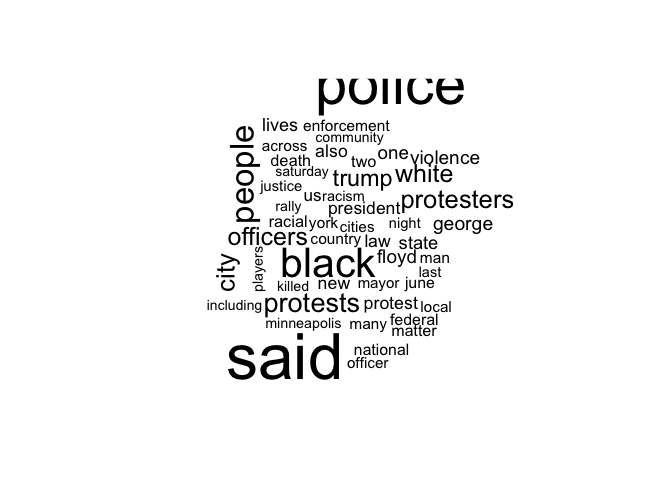

Mini-Hackathon 2: LDA Topic Modeling
================
Mariken van der Velden & Kasper Welbers

Mini-Hackathons are performed and submitted in pairs of two. You must
hand in your assignment on Canvas the next week before **Tuesday
Midnight**.

Use this RMarkdown template on the canvas page for this mini-hackathon
to complete your hackathon. When you are finished, knit the file into a
pdf with the knit button in the toolbar (or using Ctrl+Shift+K). For
this you need to have the `knitr` and `printr` packages installed, and
all your code needs to work (see the R course companion for more
instructions). If you cannot knit the `.Rmd` file, there is probably an
error in your R code, therefore add `eval=FALSE` to the code chunk: `{r,
eval = FALSE}`, so you are still able to knit and upload the file.

# This Mini-Hackathon

This mini-hackathon builds upon the tutorial on [LDA
Models](https://github.com/ccs-amsterdam/r-course-material/blob/master/tutorials/r_text_lda.md).
For this hackathon, you can (and are strongly recommended to) use code
from this week’s tutorial as well as provided here. If you aim to
conduct additional analyses in R, we of course encourage this.
Nevertheless, it is important to not do additional analysis just for the
sake of running more code chunks. For that reason, please provide a
justification for these additional analyses.

Also, we recommend to use parameters for RMarkdown codeblocks, in
particular the `cache = TRUE` parameter for codeblocks that take long to
compute (e.g., downloading data from AmCAT). A brief explanation of some
usefull parameters is given in the [the tutorial of two weeks
ago](https://github.com/MarikenvdVelden/Replication-Hackathons/blob/main/Intro-to-rmd-and-data-retrieval.md).

Important to take into account is that this week you laptop will be
doing the heavy lifting. Accordingly, in the assignment, you should be
carefull not to choose a concept that has too many articles.

### Hackathon Challenges

#### Challenge 1

Choose a data set and run a [LDA topic
model](https://github.com/ccs-amsterdam/r-course-material/blob/master/tutorials/r_text_lda.md)
to inquire the topics of the media agenda. You can either work with the
AmCAT data set with newspaper articles on the US presidential candidates
in 2020 or the Guardian data set with newspaper articles in politics,
economy, society and international sections from 2012 to 2016. To get
the data, one can run the code to download the data from
`quanteda.corpora` or download the `.csv` file with AmCAT data from
Canvas. Take a look at respectively [the tutorial of two weeks
ago](https://github.com/MarikenvdVelden/Replication-Hackathons/blob/main/Intro-to-rmd-and-data-retrieval.md)
or last week
([here](https://github.com/MarikenvdVelden/Replication-Hackathons/blob/main/Mini-Hackathon1.md)
and
[here](https://github.com/MarikenvdVelden/Replication-Hackathons/blob/main/Mini-Hackathon1-Guardian.md))
to see how to obtain the data.

For later challenges in this hackathon, please already add a `year`
variable to the corpus by running the following code if you use Guaridan
data:

``` r
library(quanteda)

df <- convert(corp, to = "data.frame") %>%
  mutate(year = substr(date, 1, 4))
corp <- corpus(df)
```

If you use AmCAT data, run the following code to add the variable:

``` r
d <-d %>%
  mutate(month = substr(date, 6, 7))
```

To conduct the analysis using LDA topic models, we have to create a
document-term matrix (DTM), for more information about DTM, [see the
tutorial on basic text analysis with
quanteda](https://github.com/ccs-amsterdam/r-course-material/blob/master/tutorials/R_text_3_quanteda.md).
Look at the tutorials of last week
([here](https://github.com/MarikenvdVelden/Replication-Hackathons/blob/main/Mini-Hackathon1.md)
and
[here](https://github.com/MarikenvdVelden/Replication-Hackathons/blob/main/Mini-Hackathon1-Guardian.md))
how you can shape the AmCAT data or the Guardian data into a dtm.

After turning the corpus into a dtm, run LDA topic model from a dfm –
have a look at the
[tutorial](https://github.com/ccs-amsterdam/r-course-material/blob/master/tutorials/r_text_lda.md)
to see how to do this.

**Don’t forget to filter the words, otherwise the procedure of running
an LDA might take forever, or even makes your computer crash.**

I will run a LDA topic model with 10 topics, and set the seed to the
date of the tutorial.

This can take some time if you do not have a powerful computer, **don’t
forget `cache=T` therefore**.

#### Challenge 2

Validation is very important when applying topic models to measure any
agenda. Inspect the results of your LDA model using `terms`, and make a
wordcloud for at least 3 topics. Give an interpretation for each topic
elaborated with an example. Have a look at the
[tutorial](https://github.com/ccs-amsterdam/r-course-material/blob/master/tutorials/r_text_lda.md#inspecting-lda-results)
for the code.

``` r
library(wordcloud)

terms(m_G, 5)
```

| Topic 1 | Topic 2 | Topic 3 | Topic 4 | Topic 5        | Topic 6    | Topic 7    | Topic 8    | Topic 9 | Topic 10 |
| :------ | :------ | :------ | :------ | :------------- | :--------- | :--------- | :--------- | :------ | :------- |
| |       | |       | |       | |       | |              | |          | |          | |          | |       | |        |
| said    | said    | people  | one     | block-time     | said       | said       | party      | trump   | said     |
| police  | people  | said    | can     | published-time | eu         | us         | said       | said    | year     |
| court   | one     | health  | says    | gmt            | government | government | labour     | clinton | $        |
| told    | two     | can     | like    | bst            | minister   | security   | government | new     | business |

``` r
topic <- 5
words_G <- posterior(m_G)$terms[topic, ]
topwords_G <- head(sort(words_G, decreasing = T), n=50)
wordcloud(names(topwords_G), topwords_G)
```

<!-- -->

``` r
terms(m_A, 5)
```

| Topic 1 | Topic 2    | Topic 3  | Topic 4 | Topic 5  | Topic 6   | Topic 7   | Topic 8     | Topic 9 | Topic 10    |
| :------ | :--------- | :------- | :------ | :------- | :-------- | :-------- | :---------- | :------ | :---------- |
| like    | court      | mr       | said    | said     | $         | mr        | said        | de      | bst         |
| one     | senate     | biden    | united  | police   | said      | trump     | coronavirus | la      | coronavirus |
| people  | said       | trump    | china   | black    | companies | president | health      | que     | �           |
| can     | republican | said     | mr      | people   | new       | said      | new         | en      | cases       |
| just    | election   | campaign | states  | protests | economic  | house     | virus       | el      | updated     |

``` r
topic <- 5
words_A <- posterior(m_G)$terms[topic, ]
topwords_A <- head(sort(words_A, decreasing = T), n=50)
wordcloud(names(topwords_A), topwords_A)
```

<!-- -->

Finally, see in which years certain topics were more
prevelent.

<!-- --><!-- -->

#### Challenge 3

Reflect on the validity of the current analysis: to what extent do the
results of the LDA model measure the media agenda?

#### Challenge 4

The method used in the tutorial is pretty crude. Can you think of any
problem in particular, and any ways to mend them? Are there problems
which cannot be solved, or would be very hard to solve?
