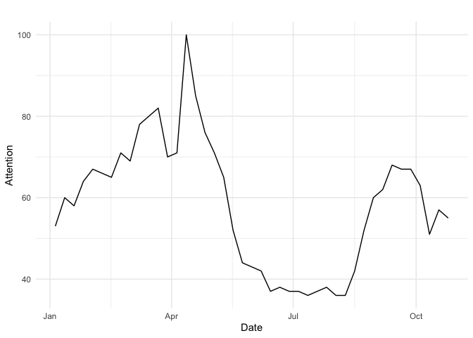

Working with Times-Series: Combining media and real-world data
================
Mariken van der Velden, Kasper Welbers & Wouter van Atteveldt

  - [Introduction](#introduction)
  - [Combining Data Sets](#combining-data-sets)
      - [Newspaper Data](#newspaper-data)
      - [Google Trends Data](#google-trends-data)
      - [Stockmarket Data](#stockmarket-data)
      - [Polling Data](#polling-data)
  - [Visualizing Times-Series](#visualizing-times-series)

# Introduction

In this tutorial we’ll discuss the basics of working with time series
data. We focus on the initial problem of preparing a time series for
analysis, by looking for and fixing missing observations and creating a
time series object. In principal, combining media data with real-world
data such as polling data, Google trends data or economic indicatores is
not difficult: assuming that both data sets have a `date` variable they
can simply be joined together.

What makes it more difficult is that often the two series are not
properly aligned. For example, most newspapers publish daily except
Sunday, while surveys are often held irregularly and stock markets are
usually closed on Saturdays.

For this tutorial, we will assume that we are investigating a
non-reciprocal effect of public opinion measured with media data and/or
google treds data. This means that for example the media can affect the
polling numbers, but not the other way around. Note that this is in most
cases not really true, as e.g. positive polling numbers can also lead to
more favourable media coverage.

In an ideal world, where both media publications and polls are simple
time points, one could assume the media can affect all polls after the
publication date, (and for the reverse effect, the polls can affect all
media published after the poll date).

In reality, of course, polls take time to conduct (and news items take
time to make and publish, especially for traditional newspapers), and
events can overlap and/or occur simulatenously. In such cases, one
should always make the assumptions that make it more difficult for your
presumed effects, to make sure that you don’t find an effect where there
is none.

An example situation is shown in the figure below, with news items on
all days except Sunday and polls published on Thursday and
Sunday:

<!-- -->

The solid arrows indicate which media days could influence which polls:
Wednesday’s news can affect Thursday’s polls, and Thursday’s through
Saturday’s news can affect Sundays polls. The dashed arrows indicate
which news days can be affected by which polls. How to interpret the
dotted arrow depends on the specifics of the poll. If you know that the
poll is published after the news item has been made, you can keep it
out. If both poll and news item are published during the day, you don’t
know which was first, and it’s possible the news item is in fact a
reaction to the poll. Keeping with the principle of making it as
difficult as possible to confirm your own hypothesis, if you are
investigating the effect of the media you should probably assume that
the poll can affect that day’s news, and not the other way around.

Finally, the grey lines are the *autocorrelations* present in most time
series: To predict today’s polls (or news, stockmarket, or weather),
often yesterday’s polls are the best predictor. You can include the
autogression as a *control* variable, or take the change in polling. To
decide which is best, include it as a control variable first. If the
autocorrelation is almost 1, take the difference instead,

Note: the considerations above are a very simple (or even simplistic)
first approach at doing time series analysis. There are whole
graduate-level courses taught just about time series analysis (not to
mention books with more equations than we like reading) To learn more,
you can start by looking at some of the resources below:

  - [R Task view on time series
    analysis](https://cran.r-project.org/web/views/TimeSeries.html)
  - [An older tutorial on VAR and ARIMA in
    R](https://github.com/vanatteveldt/learningr/blob/master/7_timeseries.md)
  - An atricle introducing time series analysis to social scientists:
    Vliegenthart, R. (2014). Moving up. Applying aggregate level time
    series analysis in the study of media coverage. Quality & quantity,
    48(5), 2427-2445.

# Combining Data Sets

For this tutorial, we will see whether (a) the subjective state of the
economy, i.e. public opinion on measured with economic news coverage and
google trends data; or (b) the objective state of the economy,
i.e. stockmarket data, had a positive effect on Trump’s poll ratings in
the 2020 elections.

## Newspaper Data

I use the `amcatr` API for the Guardian data on the 2020 U.S.
presidential canidates. Note that you need to have to use
`amcat.save.password` to run this code. You can create an account for
amcat at https:
<https://amcat.nl/>.

``` r
if (!require(devtools)) {install.packages("devtools"); library(devtools)}
install_github("amcat/amcat-r")
library(amcatr) 

conn <- amcat.connect('http://vucw.amcat.nl')
d <- amcat.hits(conn, queries = 'economy', labels = 'eu', sets = 21, 
                project = 1, col = c('date','medium','headline','text')) 
saveRDS(d, "../economy_articles.rds")
```

As a first step, we aggregate the data per day:

``` r
media <- articles %>% 
  mutate(date=as.Date(date)) %>% 
  group_by(date) %>% 
  summarize(n=n()) %>%
  ungroup()
```

Since we use a search query that returns articles, this series does not
include days without articles. If needed, this can be remedied by
joining with a series of all dates created with the `seq.date`
function:

``` r
all_days <- data.frame(date=seq.Date(as.Date("2020-01-01"), as.Date("2020-10-31"), by=1))

media <- left_join(all_days, media) %>% 
  mutate(n=ifelse(is.na(n), 0, n))
```

Note that if you have a source that e.g. does not publish on Sunday, you
might want to remove Sundays from the series using the `weekdates`
function.

## Google Trends Data

With [google trends](https://trends.google.com/trends/) you can explore
how often people searched for a keyword, in web search or in google
news. Since people presumably search for information on topics they find
important or interesting, this can be used as a crude proxy for public
salience of a topic. For example, if you search for `gun control` you
find a clear peak after the recent Las Vegas shooting and around earlier
mass shootings, and a smaller peak around the US elections.

### Accessing Google Trends from R

Google offers the data through an API, so (naturally) there is an R
package to retrieve the data. Before starting, you need to install the
package from
github:

``` r
if (!require(devtools)) {install.packages("devtools"); library(devtools)}
devtools::install_github("PMassicotte/gtrendsR")
```

Now, you can use the `gtrends` function to query for a specific keyword.
For this tutorial, this shows the attention for the *economy* in the
U.S. in 2020, you can use a query like:

``` r
library(gtrendsR)
res <- gtrends(c("economy"), geo = c("US"), time="2020-01-01 2020-10-31")

trend <- res$interest_over_time
```

And you can e.g. plot this over time:

``` r
ggplot(data = trend, mapping = aes(x = date, y = hits)) +
  geom_line() +
  labs(x = "Date", y = "Attention", title = "") +
  theme_minimal()
```

<!-- -->

Note: If you want to merge this with AmCAT aggregate data, one problem
is that google trends weeks start on Sunday, while AmCAT weeks start on
Monday. The easiest solution is to add one day to the google trends
data, which is mostly fine since newspapers generally don’t appear on
Sunday.

When working with time data, it’s important to take into account that
date/time can be represented in different formats. In our case, we need
to first convert the Google trends date into a *Date format*. For
illustration, we make a separate date value, called `date2`, so you can
see whether there are no problems in the conversion:

``` r
trend <- trend %>%
  mutate(date2 = as.Date(as.character(trend$date)))
```

One (particularly mean) thing to watch out for, is that there can be
problems due to different time zones. If Google trends returns a date
and time at `2016-01-01 00:00:00` in a certain timezone, then depending
on your time locale settings (don’t ask) R might think that it needs to
subtract some hours, after which your date suddenly becomes
`2015-12-31`\! Thus, for your output, you should check whether the
converted date (`date2`) is still on the same day as the original date
(`date`). If not, you should add `1` to the date (which R interprets as:
add one day). In the following example, we add a third date column to
illustrate this:

``` r
trend <- trend %>%
  mutate(date3 = as.Date(as.character(trend$date)) + 1)
```

Now that you have a date in the same format as used by `amcatr`, we can
merge with amcat aggregate data without problem.

Note: there are more elegant ways of dealing with date and time
problems, but we ignore those for now for sake of simplicity.

## Merge Data

Now we can merge the `trend` and `media` `data.frames` by the `date`
column using `join`. We use `full_join`, so that all weeks that are in
at least one of the two `data.frames` are kept.

``` r
d <- full_join(x = trend, y = media, by = "date")
head(d)
```

    ##         date hits keyword geo                  time gprop category      date2
    ## 1 2020-01-05   52 economy  US 2020-01-01 2020-10-31   web        0 2020-01-05
    ## 2 2020-01-12   58 economy  US 2020-01-01 2020-10-31   web        0 2020-01-12
    ## 3 2020-01-19   58 economy  US 2020-01-01 2020-10-31   web        0 2020-01-19
    ## 4 2020-01-26   63 economy  US 2020-01-01 2020-10-31   web        0 2020-01-26
    ## 5 2020-02-02   68 economy  US 2020-01-01 2020-10-31   web        0 2020-02-02
    ## 6 2020-02-09   66 economy  US 2020-01-01 2020-10-31   web        0 2020-02-09
    ##        date3  n
    ## 1 2020-01-06 15
    ## 2 2020-01-13 14
    ## 3 2020-01-20 19
    ## 4 2020-01-27 10
    ## 5 2020-02-03 22
    ## 6 2020-02-10 18

Note that we now have some colums that are superfluous. It’s good
practise to have self-explanatory column names, so let’s change them.

``` r
d <- d %>%
  select(date, keyword, google_trends = hits, media_attention = n) %>%
  mutate(keyword = replace_na(keyword, "economy"))
```

### Options and Limitations

To see the options provided by Google Trends and `gtrendsr`, look at the
google trends homepage and at the gtrends help file (in RStudio). In
particular, you can specify which country, which date range, and which
source (web, news, video) to search in. Unfortunately, you can’t specify
the date interval - google automatically decides to return monthly,
weekly, or daily data depending on how long your query is. You can also
not complex queries like in AmCAT, you can only use simple keywords or
phrases. Also, the results returned by google are always relative (the
highest peak is always 100), so you can’t simply compare data retrieved
in multiple queries: you either need to put everything in a single
query, or have an overlap in data and use that to callibrate the
different sets.

## Stockmarket Data

To get the stock data, we’ll use the quantmod package, which allows us
to download the data directly from Yahoo.

``` r
install.packages('quantmod')
```

``` r
library(quantmod)
```

The following code is a bit tricky, so don’t be alarmed if its hard to
follow. You only need to understand the parts where you use (and need to
change) the symbols for the organization and the date.

In this example, we’ll use the symbol `^DJI`, which represent the Dow
Jones Index. For reference, [ticker
symbols](https://en.wikipedia.org/wiki/Ticker_symbol) are simply unique
company identifiers. In the example below, the Dow Jones symbol has a
caret (^), which is typically used to signify an index.

``` r
symbols <- "^DJI"
start_date <- as.Date('2020-01-01')
end_date <- as.Date('2020-10-31')

getSymbols(symbols, from=start_date, to=end_date, src='yahoo')
```

    ## [1] "^DJI"

The data, as downloaded with `getSymbols`, is automatically stored as
data, using the ticker symbols as names. In our case, this is `DJI`. The
caret (^) was dropped, because this is not an allowed symbol for names
in R. The data is automatically in the `zoo` time series format (as we
used in Lab 1 for fancy plotting). Note that you do not have to use
`library(zoo)` yourself, because it is a dependency of the `quantmod`
package (i.e. `quantmod` uses `zoo`, and thus opens it for you).

### Inspecting the Data and Dealing with Missing Values

When calling `getSymbols` you might have received the warning that your
data contains missing values. Accordingly, it is wise to first look at
our data to see how severe the damage is. It could be that the time
period we requested is not fully available, in which case we will have
to `subset` the data (as also used in Lab 1) to only include the periode
where we have data. We will plot the data using the candleChart function
from the `quantmod` package, which is a specialized chart for stock
market
data.

``` r
candleChart(DJI)
```

<!-- -->

We don’t see any large blocks of missing data, so we can safely assume
that the missing cases (i.e. days) occur sparsely.  
Since we are dealing with time-series, dropping these values is
problematic (we will lose more than just these cases, because cases in
time series are not always independent). For the media content data that
we used before, we could assume that missing values are 0, but for stock
market data we are certain that this is not the case. Instead, there are
some tricks to estimate what the missing values is likely to be. One
common trick is to use the `na.locf` funtion (also in the `zoo`
package), that replace each NA value with the previous value in the same
column (locf means ‘last observation carried forward’). Here we use a
similar trick called `na.approx`, which uses linear interpolation to
guess the value. For illustration, in the following example we can guess
by linear interpolation that the missing values are `2` and `3.5`.

``` r
x <- c(1,NA,3,4,NA,3)
na.approx(x)
```

    ## [1] 1.0 2.0 3.0 4.0 3.5 3.0

We can run na.approx on the entire data.frame, and it will automatically
transform NA’s in all columns.

``` r
DJI <- na.approx(DJI)
```

### Adding Intra-Day Volatility

The intra-day volatility is the absolute difference between the lowest
and highest price within the same day. It thereby provides an indication
of how volatile the share was on that day. Calculating the absolute
difference is straigforward: subtract \*.Low (lowest value on day) from
\*.High(highest value on day)

``` r
stock <- DJI
stock$DJI.ID_volat <- stock$DJI.High - stock$DJI.Low
head(as.data.frame(stock))
```

    ##            DJI.Open DJI.High  DJI.Low DJI.Close DJI.Volume DJI.Adjusted
    ## 2020-01-02 28638.97 28872.80 28627.77  28868.80  251820000     28868.80
    ## 2020-01-03 28553.33 28716.31 28500.36  28634.88  239590000     28634.88
    ## 2020-01-06 28465.50 28708.02 28418.63  28703.38  252760000     28703.38
    ## 2020-01-07 28639.18 28685.50 28565.28  28583.68  258900000     28583.68
    ## 2020-01-08 28556.14 28866.18 28522.51  28745.09  291750000     28745.09
    ## 2020-01-09 28851.97 28988.01 28844.31  28956.90  275060000     28956.90
    ##            DJI.ID_volat
    ## 2020-01-02     245.0312
    ## 2020-01-03     215.9512
    ## 2020-01-06     289.3887
    ## 2020-01-07     120.2207
    ## 2020-01-08     343.6699
    ## 2020-01-09     143.6992

### Merging the Data

Here, I make use of the fact that both the stock market data (`stock`)
and the media data (`media`) are in the zoo timeseries format, so I can
directly merge them on their index (i.e. date).

``` r
d$date <- as.POSIXct(d$date, format =  "%Y-%m-%d")
d <- xts(d, order.by = d$date)

d <- merge(stock, d)
d <- subset(d, select = c(DJI.ID_volat, google_trends, media_attention))
head(as.data.frame(d))  ## use as.data.frame for prettier printing (due to compatibility printr and zoo)
```

    ##            DJI.ID_volat google_trends media_attention
    ## 2020-01-01           NA            NA              16
    ## 2020-01-02     245.0312            NA              12
    ## 2020-01-03     215.9512            NA              16
    ## 2020-01-04           NA            NA              14
    ## 2020-01-05           NA            52              15
    ## 2020-01-06     289.3887            NA              16

To later merge the polling data, I need to convert the `dt` data set
into class `data.frame`:

``` r
d <- data.frame(date=index(d), coredata(d))
```

## Polling Data

For the polling data, we take the ABC news as (re)published by 538,
taking only the now-cast, raw numbers and the end date. For the
difference between the poll types and results, see [their methodology
page](https://fivethirtyeight.com/features/a-users-guide-to-fivethirtyeights-2020-general-election-forecast/).

We take the start date here since news can potentially influence polls
until the end date, and we can be sure that the polls were not published
before the end date. One could argue we should take the start date, as
individuals who have aready responded can no longer be influenced by
news published later. If you have access to raw survey results, you can
see the actual date each individual answered the poll, which would give
more precise
results.

``` r
url <- "https://projects.fivethirtyeight.com/polls-page/president_polls.csv"
polls <- read_csv(url) 
polls <- polls %>% 
  filter(pollster == "ABC News/The Washington Post", candidate_name == "Donald Trump") %>% 
  mutate(date = as.Date(end_date, format ="%m/%d/%y")) %>% 
  arrange(date) %>% 
  filter(date >= "2020-01-01") %>%
  group_by(date) %>%
  summarise(support_trump = mean(pct, na.rm=T)) %>%
  ungroup()
```

### Combining Data Sets

Now that we have media data and polling data, we can combine them. Not
all days have polls, especially in the earlier period. As explained
above, we want to ‘assign’ all days between two polling dates to that
date.

### Level of Aggregation

The way to do this in R is to join the two data sets and create a new
“poll date” variable that is at first only non-missing for dates with
a poll. The easiest way to achieve this is to create the extra date
column before we join:

``` r
polls2 <- polls %>% 
  select(date) %>% 
  mutate(poll_date=date)

d <- left_join(d, polls2)
head(d, 15)
```

    ##          date DJI.ID_volat google_trends media_attention poll_date
    ## 1  2020-01-01           NA            NA              16      <NA>
    ## 2  2020-01-02    245.03125            NA              12      <NA>
    ## 3  2020-01-03    215.95117            NA              16      <NA>
    ## 4  2020-01-04           NA            NA              14      <NA>
    ## 5  2020-01-05           NA            52              15      <NA>
    ## 6  2020-01-06    289.38867            NA              16      <NA>
    ## 7  2020-01-07    120.22070            NA              15      <NA>
    ## 8  2020-01-08    343.66992            NA              29      <NA>
    ## 9  2020-01-09    143.69922            NA              21      <NA>
    ## 10 2020-01-10    219.97070            NA              20      <NA>
    ## 11 2020-01-11           NA            NA              14      <NA>
    ## 12 2020-01-12           NA            58              14      <NA>
    ## 13 2020-01-13     90.48047            NA              24      <NA>
    ## 14 2020-01-14    181.89062            NA              28      <NA>
    ## 15 2020-01-15    230.24023            NA              27      <NA>

Now, we want to fill in all missing values to the top, i.e. each poll
date should taking the value from the next non-missing date using the
tidyverse `fill` function:

``` r
d <- d %>% 
  fill(poll_date, .direction = "up")
```

Finally, we can aggregate the media data per poll date, for example
taking the mean daily number of articles, google trend searches, and the
standard deviation around the stock volatility each `poll_date`:

``` r
d_aggregated <- d %>% 
  group_by(poll_date) %>% 
  summarize(media=mean(media_attention, na.rm = T),
            trends=mean(google_trends, na.rm = T),
            stock_volat=sd(DJI.ID_volat, na.rm = T)) %>% 
  rename(date=poll_date) %>%
  ungroup()
```

#### Joining the Series

Now we can join the series.

Before we proceed, let’s also add the lagged (previous) poll and change
in poll (differenced poll) as columns so we can control or differentiate
as needed: (we do this now because the first value would otherwise be
dropped by the join)

``` r
polls <- polls %>% 
  mutate(l_trump = lag(polls$support_trump), 
         d_trump= support_trump - l_trump)
```

Now, we are ready to join with the media data:

``` r
combined <- inner_join(d_aggregated, polls)
```

# Visualizing Times-Series

We now have the time series cleanly together, and ready to perform time
series analysis. In this tutorial, we’ll only focus on qualitatively
comparing the time series. Let’s visualize the data to make this easier.

``` r
# Make data set "long" for visualization purposes
long_d <- combined %>%
  pivot_longer(cols = media:support_trump) %>%
  select(date, id = name, value) %>%
  mutate(id2 = ifelse(id == "support_trump", "Outcome Variable",
               ifelse(id == "media", "Subjective Economy",
               ifelse(id == "trends", "Subjective Economy", "Objective Economy"))))

ggplot(data = long_d, 
       mapping = aes(x = date, y = value, group = id, colour = id)) +
  geom_line() +
  labs(x = "", y = "Mean Values", title = "Times-Series: Objective and Subjective State of the Economy & Trump Support") +
  theme_minimal() +
  facet_wrap(.~id2, scales = "free") +
  scale_color_manual(values=c("seagreen", "violet","coral3", "dodgerblue4")) +
  theme(legend.title=element_blank(), #edit the legend
        legend.position = "bottom",
        plot.title = element_text(hjust = 0.5))
```

<!-- -->

At this point it might be appropriate to say that we do not actually
need to use this complex, lengthy custom plot code. R has special
classes for dealing with time series, that make it easier to work with
them in many ways. We will discuss this more next week, when we address
statistical tools for time series analysis. For now, we just show how
this makes plotting easier.

``` r
## we use the zoo package, which we first need to install
install.packages('zoo')
```

``` r
library(zoo)
```

``` r
## transform data to a format for time series.
dt <- zoo(combined[,c('media','trends', 'stock_volat','support_trump')], order.by = combined$date)

## the plot function now immediately does something usefull for time series analysis
plot(dt, main = 'Times-Series: Objective and Subjective State of the Economy & Trump Support')
```

<!-- -->

Once you are working with a dedicated format for time series analysis it
becomes easy to do advanced and fancy stuff. For example, making
interactive plots to help explore and interpret time series data.

``` r
install.packages('dygraphs')
```

``` r
library(dygraphs)

dygraph(dt, main="Times-Series: Objective and Subjective State of the Economy & Trump Support") %>% 
  dyRangeSelector()
```

So, does the objective or subjective state of the economy forecast a
change in polling for trump?

``` r
#Subjective state of the economy
cor.test(combined$media, combined$d_trump)
cor.test(combined$trends, combined$d_trump)
#Ojective state of the economy
cor.test(combined$stock_volat, combined$d_trump)
```

Apparently, none of them do: the correlation is almost zero and not
significant. This can be due to may things, from the oversimple
measurement using only the word economy; the use of aggregate polls
rather than individual panel survey results; or simply because the state
of the economy in the end was not the deciding issue.

To find a better answer we can improve any of these things, but
hopefully this tutorial gave a good first overview of the techniques and
considerations for combinining data sets for a quantitative study.
